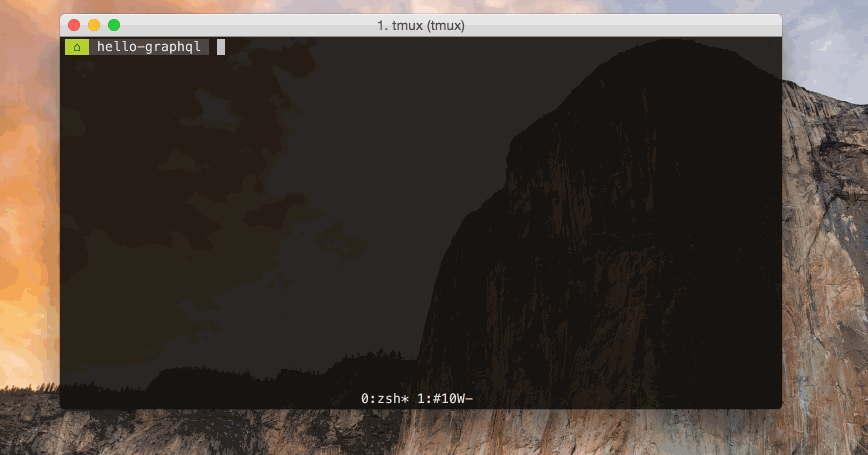

# graphqlviz [](https://travis-ci.org/sheerun/graphqlviz)

> GraphQL Server CLI visualizer. Adapted from original [web interface](https://github.com/NathanRSmith/graphql-visualizer).



## CLI

```
$ npm install -g graphqlviz
```

```
GraphQL Server CLI visualizer

Options:
  -g, --graphql    use graphql schema language as input
  -t, --theme      path to theme overrides
  --print-theme    prints default theme to stdout
  --verbose        print introspection result

Usage
  $ graphqlviz [url]
      Renders dot schema from [url] endpoint

Examples
  $ graphqlviz https://localhost:3000 | dot -Tpng -o graph.png
  $ graphqlviz https://swapi.apis.guru | dot -Tpng | open -f -a Preview
  $ graphqlviz path/to/schema.json | dot -Tpng | open -f -a Preview
  $ graphqlviz path/to/schema.graphql -g | dot -Tpng | open -f -a Preview
  $ graphqlviz --print-theme > theme.json
  $ graphqlviz https://localhost:3000 -t theme.json | dot -Tpng | open -f -a Preview
  $ graphqlviz schema.json --theme.header.invert=true | dot -Tpng > schema.png
```

Note that `dot` is `graphviz`'s tool to produce layered drawings of directed graphs. `graphviz` is available through most package managers including homebrew and apt-get. Details here: https://www.graphviz.org/download/

## Customizing output

You can print default theme with `graphqlviz --print-theme > theme.json`, then you can modify it, and pass with `--theme theme.json` argument. All the available colors can be found on the [graphviz site](http://www.graphviz.org/doc/info/colors.html). 

## Team

[](https://sheerun.net) | [](http://nathanrandal.com/) | [](https://github.com/sheerun/graphqlviz/pulls)
---|---|---
[Adam Stankiewicz](https://sheerun.net) | [Nathan Smith](http://nathanrandal.com/) | [Join](https://github.com/sheerun/graphqlviz/pulls)
